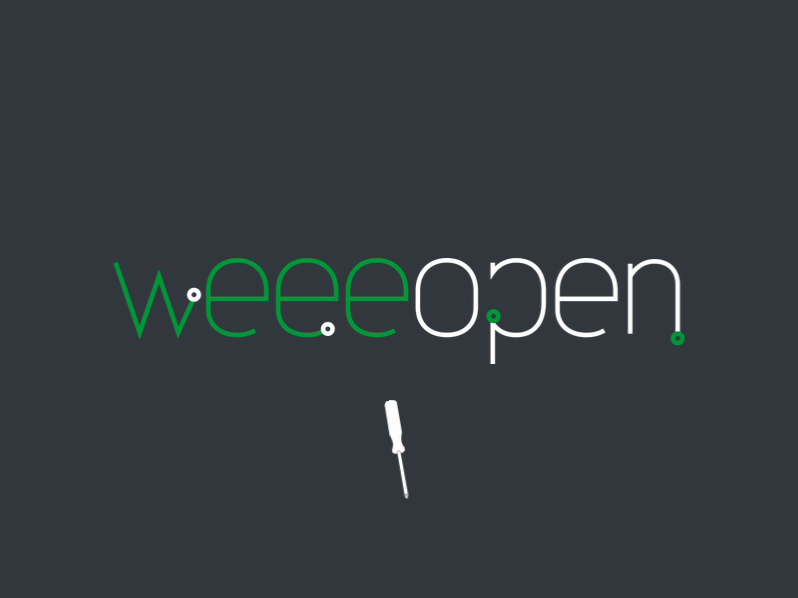

# PESCA

#### Preparazione Effettuata tramite Script dei Computer Anarchici

Run this script after the installation of Xubuntu on the machine preparing it for donation.

To do that, download the script:

    git clone https://github.com/WEEE-Open/pesca.git
    cd pesca

change permission:

    chmod +x pesca.sh
    
and run it:

    ./pesca.sh
    
Please don't use `sudo`. It will ask the admin password when necessary.
    
If the computer is damn slow and you are sleepy, hungry or whatever so you want to leave the computer alone you can do this by adding `-sn` parameter:

    ./pesca.sh -sn
    
in order to shut down the machine auotmatically when the script ends its job.

Enjoy.

## Further development

- [ ] Use `debconf-apt-progress` instead of `apt` to improve visual appeal (it's in the "installa" funcion but it's unused).

## Only Plymouth

If you want to install only our fancy Plymouth theme:

    git clone https://github.com/WEEE-Open/pesca.git
    cd pesca
    sudo cp -r weee-logo/ /usr/share/plymouth/themes/
    sudo update-alternatives --install /usr/share/plymouth/themes/default.plymouth default.plymouth /usr/share/plymouth/themes/weee-logo/weee-logo.plymouth 100
    sudo update-alternatives --set default.plymouth /usr/share/plymouth/themes/weee-logo/weee-logo.plymouth
    sudo update-initramfs -u

Those commands work in Ubuntu and derivatives only.
As they say in Tuscany: `Sono hazzi tua!` if you are running other distros like Debian or Arch.
